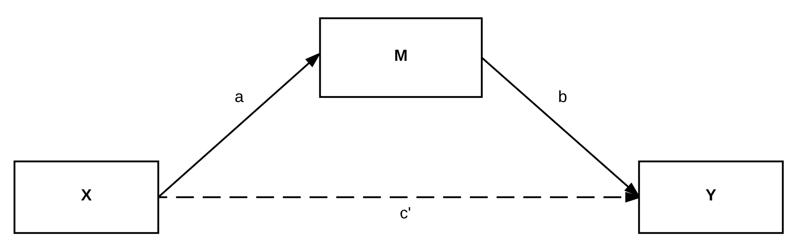
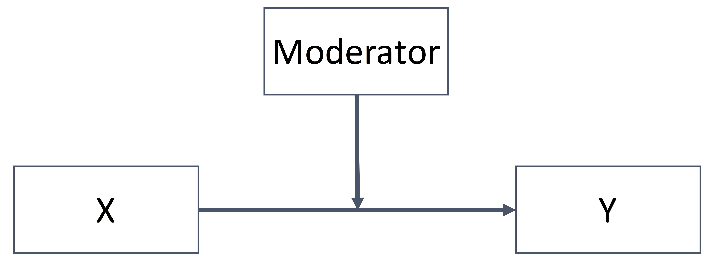
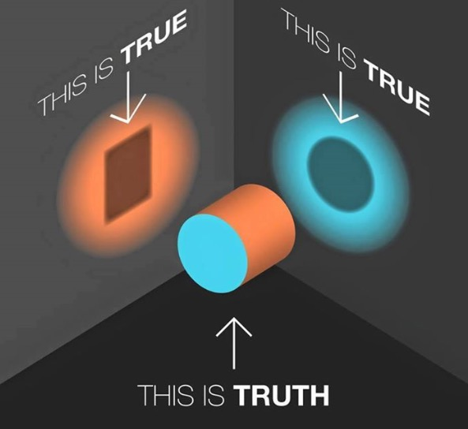

```{r setup, include=FALSE}
options(htmltools.dir.version = FALSE)
```
# What is Real?

.huge[
[https://www.youtube.com/watch?v=ym6NEuUYHuE](https://www.youtube.com/watch?v=ym6NEuUYHuE)
]

---
class: inverse

# What is mediation analysis?
# How do we interpret it?
# Current Issues (and Solutions)
# How do we use it? (in R)

---
background-image: url(BaseMediation.png)
background-size: contain
background-repeat: no-repeat

# What is Mediation Analysis?

.footnote[
X = predictor, independent variable, exogenous variable &nbsp;&nbsp;&nbsp;&nbsp;&nbsp;&nbsp;&nbsp;&nbsp;&nbsp; a = path from X to M    <br> 
M = mediator, intermediate variable, endogenous variable &nbsp; &nbsp;&nbsp;&nbsp; b = path from M to Y (controlling for X) <br> 
Y = outcome, endogenous variable &nbsp;&nbsp;&nbsp;&nbsp;&nbsp;&nbsp;&nbsp;&nbsp;&nbsp;&nbsp;&nbsp;&nbsp;&nbsp;&nbsp;&nbsp;&nbsp;&nbsp;&nbsp;&nbsp;&nbsp;&nbsp;&nbsp;&nbsp;&nbsp;&nbsp;&nbsp;&nbsp;&nbsp;&nbsp;&nbsp;&nbsp;&nbsp;&nbsp;&nbsp;&nbsp;&nbsp;&nbsp;&nbsp;&nbsp;&nbsp;&nbsp;&nbsp;&nbsp;&nbsp;&nbsp;&nbsp;&nbsp;&nbsp;&nbsp; c' = path from X to Y (controlling for M)
]

---
# Different than Moderation (Interactions)

.pull-left[
## Mediation Analysis Model

The effect of X is transmitted through M.

]

--

.pull-right[
## Moderation (Interaction)

The effect of X depends on the level of Moderator.

]

---
# Mediation Analysis?

.pull-left[
.large[.large[
- Built on .dcoral[theory, prior literature, and other observations]
- Has similar .nicegreen[assumptions to regression]
- Built up of .bluer[2+ regression models]
- Can combine with moderation
]]]

--

.pull-right[
.large[.large[
- Helps explain .dcoral[how] X affects Y
- Provides additional .bluer[targets of intervention]
- Helps explain strange results (conflicting results)
- Provides a more .nicegreen[holistic view] of the relationships
]]]

---
# Built on Theory

.huge[Why even mention it?]

.large[.large[
Mediation analysis has similar .dcoral[assumptions] to regression but they are somewhat more pronounced in mediation
]]

--

.pull-left[
.large[
- Well-behaved residuals (normality and homoskedasticity)
- .bluer[*No omitted influences*]
]]

.pull-right[
.large[
- .nicegreen[*No measurement error*]
- Correct functional form 
]]

--

.large[.large[
These are (often) difficult to assess and correct
]]

---
# No Omitted Influences

.huge[
.dcoral[Two Main Principles:]
]

.large[.large[
1. If something is .nicegreen[related to X (or M) and Y], it needs to be in the .nicegreen[path b and c' model]
2. If something is .bluer[related to X and M], it needs to be in the .bluer[path a model]
]]

--

.large[
Example: If we are assessing religiosity (X) and heavy drinking behavior (Y), what are some variables that should be included?
]

---
# Slight Caveat

.huge[
.dcoral[*If* X is randomized] (e.g., treatment or control), then statistical theory says no other variables are related to X.
]

.huge[
But .bluer[we cannot randomize M] (at least in a single study) so even if we can get a causal relationship from X to M and X to Y, we cannot obtain causal M to Y.
]

---
# No Measurement Error

.huge[
Measurement error is always a problem (unless we use latent variable methods):
]
.large[.large[
- But can be .dcoral[more pronounced] in mediation analysis

  - If M has measurement error, it not only messes with M's estimate but also X's estimate

- Difficult to know in many situations how extensive measurement error is
]]

???
The other assumptions are all more like that of regression

---
# Quick Review of Linear Regression

```{r, message = FALSE, warning = FALSE, echo = FALSE, fig.align='center', fig.height=6, fig.width=15}
library(tidyverse)
set.seed(843)
p1 = tibble(
  X = rnorm(100),
  Y = X + rnorm(100)
) %>%
  ggplot(aes(X, Y)) +
    geom_point(alpha = .7, color = "black", shape = 21, fill = "dodgerblue4") +
    geom_smooth(method = "lm", 
                color = "coral2", 
                fill = "dodgerblue4",
                alpha = .2) +
  theme_minimal() +
  labs(x = "X (continuous variable)")
p2 = tibble(
  X = rnorm(100),
  Y = X + rnorm(100),
  Z = ifelse(X > 0, 1, 0)
) %>%
  ggplot(aes(factor(Z), Y)) +
    geom_jitter(alpha = .7, color = "black", shape = 21, fill = "dodgerblue4") +
    geom_segment(x = .5, xend = 1.5, y = -.5, yend = -.5,
                 color = "coral2", 
                 alpha = .7) +
    geom_segment(x = 1.5, xend = 2.5, y = .5, yend = .5,
                 color = "coral2", 
                 alpha = .7) +
  theme_minimal() +
  labs(x = "Z (grouping variable)")

gridExtra::grid.arrange(p1, p2, ncol = 2)
```

---
# Mediation is 2+ Regression Models

.huge[Mediation uses a .dcoral[series of regressions] and .nicegreen[combines results] to draw conclusions about the overall model]


---
class: inverse, center, middle

# Break Time
### Take a short break but be thinking about mediation models you have seen in your field

---
# Mediation Frameworks

.pull-left[
.huge[
1. Ordinary Least Squares (OLS) and Generalized Linear Models (GLM) Regression

2. Structural Equation Modeling (SEM)
]
]

.pull-right[

]

.footnote[These are very related, but distinct, approaches]

---
# Two Frameworks

.pull-left[
## .dcoral[OLS/GLM Regression]

.large[
- Multiple regressions, fit separately and then combined
- Provides great flexibility (assumptions are lighter)
- Provides model fit for each sub-model but not the entire model
- Continuous, binary, categorical, count, proportion, and other variable types
]]

--

.pull-right[
## .nicegreen[SEM]

.large[
- Multiple regressions fit simultaneously
- More restrictive assumptions
- Provides more information regarding overall model fit
- Mostly continuous variables (can handle binary, ordinal in some cases)
]]

???
Here are two examples of OLS/GLM fitted mediation models

---
background-image: url(fig_application_model.jpg)
background-size: contain
background-repeat: no-repeat

???
There are many, many others using SEM or Regression frameworks.

---
class: inverse, middle, center
# Interpretation of Mediation

---
# Interpretation of Mediation

.huge[Mediation models provides lots of information:]

.large[.large[
1. Individual path estimates
2. Indirect Effect estimates
3. Direct Effect estimates
4. Total Effect estimates
]]

---
# Interpretation of Mediation

.huge[Mediation models provides lots of information:]

```{r, echo=FALSE, message=FALSE, warning=FALSE}
library(tidyverse)
data.frame(
  Estimate = c("Individual paths", "Indirect Effect", "Direct Effect", "Total Effect"),
  What     = c("a, b, and c' paths", "a path estimates * b path estimates", "c' estimate", "a * b + c'")
) %>%
  DT::datatable(options = list(dom = "d"))
```

---
# Complete or Partial Mediation?

.huge[
Many resources suggest ways of looking at this
]
.large[.large[
- I recommend not focusing on this but feel free to check
- Its based on whether `c'` is significant or not (while `a * b` is significant)

I think it paints an .dcoral[incomplete picture] of the model because:
]]
.large[
1. It only focuses on significance, not effect size
2. To really make this conclusion, we need really large sample sizes
3. It is almost always "partial" mediation
]

???
A better approach is looking at the effect sizes -- how big is the indirect effect size compared to the direct or total effect sizes?


---
# Continuous Mediators and Outcomes

.huge[
When the .nicegreen[mediator and outcome are both continuous] (an roughly normal), interpretation is straightforward
]

.large[
1. Paths are in terms of the corresponding endogeous variable's units
2. Indirect effects are in the outcome's units
3. Direct effects are in the outcome's units
4. Total effect is in the outcome's units
]

--
.large[
Example: If X is continuous, the indirect effect is 2.5, and the outcome is in quality of life rating, what is the interpretation?
]

--

.large[.large[
.dcoral[But what if mediator(s) and/or outcome(s) are categorical?]
]]


---
class: inverse, center, middle

# Mediation Analysis with Categorical Variables

---
# .coral[Generalized] Linear Models

.large[.large[These **generalize** the regression framework to more data situations.]]

--

.large[.large[
To do so:

1. Can use a different **distribution** 📊

2. Uses a **link** function ⛓
]]

.large[Examples: Logistic Regression, Poisson Regression]


---
background-image: url(fig_binarymediator.jpg)
background-size: contain
background-repeat: no-repeat

# Use GLMs with Mediation Analysis

???
### But...
This presents a new challenge in interpreting the results


---
# Interpretation with Categorical Mediator/Outcome

.large[.large[
A few options:

1. Intepret the .nicegreen[individual pathways and note the percent of mediation]. This approach is commonly used in the literature.

2. New: .dcoral[Marginal Mediation Analysis]. Is being prepared right now (shows serious promise for these situations).
]]

---
### Interpret Individual Pathways

.large[Three Steps:
1. Fit individual GLM regressions for all pathways (`a`, `b`, `c'` and `c`)
2. Discuss basic effect size information for each pathway
3. Evaluate the change from `c` to `c'` as a proportion of `c` -- $\frac{c-c'}{c}$. This is a representation of how much of the total effect is mediated.
]

--

### Marginal Mediation Analysis

.large[
- Uses Average Marginal Effects
- Interpretation and steps for use are exactly like mediation with continuous mediators/outcomes (can interpet individual paths, indirect and direct effect sizes)
- Uses bootstrapping to get confidence intervals (recommended in most situations)
]


---
class: inverse, middle, center

# How to use it?

---
# Before Talking About Syntax

.huge[
I recommend two books to get more information about mediation topics

1. .dcoral[Statistical Mediation Analysis] by MacKinnon

2. .dcoral[Introduction to Mediation, Moderation, and Conditional Process Analysis] by Hayes
]

---
class: inverse, middle, center

## Break Time
### If you do not care about learning how to do these analyses in R then feel free to take off (thanks for attending 😄)

---
# Mediation Analysis in `R`

.large[
.large[If you are not an `R` user you can ignore the syntax .nicegreen[but pay attention to the logic of it]]

.large[We'll use a fake data set about two popular TV shows--The Office and Parks and Recreation.]
]

<br>

.coral[.large[Note: We'll be ignoring some assumptions (like the fact the data are nested).]]


---
# Dataset

```{r, echo=FALSE, message=FALSE, warning=FALSE}
library(DT)
library(tidyverse)
set.seed(84322)

## loads 'df'
load("Data/OfficeParks.RData")
df = df %>%
  filter(complete.cases(spor, inco, prod1, phys))

df %>%
  select(1:12) %>%
  datatable(options = list(pageLength = 5))
```

---
# Start with .coral[Cross-Tabulations]

.large[.large[
Check for small cells, understand missingness
]]

```{r, echo=FALSE, comment = "                     ", message=FALSE, warning=FALSE}
df %>%
  mutate(SubsUse = factor(subs, labels = c("No", "Yes"))) %>%
  group_by(SubsUse) %>%
  furniture::table1("Income" = inco,
                    "Productivity" = prod1,
                    "Physical_Health" = phys, 
                    "Married" = factor(marr, labels = c("No", "Yes")),
                    "Race" = race,
                    output = "text2",
                    type = "condense",
                    test = TRUE)
```

---
# And with .coral[Correlations]

.large[.large[
Check for high correlations (can cause multi-collinearity problems)
]]

```{r, echo=FALSE, comment = "                     ", message=FALSE, warning=FALSE}
df %>%
  furniture::tableC("Income" = inco,
                    "Productivity" = prod1,
                    "Physical_Health" = phys)
```

---
# SEM Framework

.large[
```{r, message=FALSE, warning=FALSE, eval=FALSE}
library(lavaan)

model = "
prod1 ~ a*subs
inco ~ b*prod1 + c1*subs

ind := a * b
dir := c1
tot := a * b + c1"

fit_sem = sem(model, data = df)
parameterEstimates(fit_sem)
fitMeasures(fit_sem)
```
]

---

```{r, message=FALSE, warning=FALSE, echo=FALSE, comment = "       "}
library(lavaan)
model = "
prod1 ~ a*subs
inco ~ b*prod1 + c1*subs
ind := a * b
dir := c1
tot := a * b + c1
"
fit_sem = sem(model, data = df)
cat("Parameter Estimates\n")
parameterEstimates(fit_sem)
cat("Fit Statistics\n")
fitMeasures(fit_sem)
```


---
# OLS Framework (Using Marginal Mediation Analysis)

.large[
```{r, message=FALSE, warning=FALSE, eval=FALSE}
library(MarginalMediation)

patha  = glm(prod1 ~ subs, data = df)
pathbc = glm(inco ~ prod1 + subs, data = df)

mma(pathbc, patha,
    ind_effects = c("subs-prod1"),
    boot = 500)
```
]

---

```{r, message=FALSE, warning=FALSE, echo=FALSE, comment = "     "}
library(MarginalMediation)
patha  = glm(prod1 ~ subs, data = df)
pathbc = glm(inco ~ prod1 + subs, data = df)
mma(pathbc, patha,
    ind_effects = c("subs-prod1"),
    boot = 500)
```

---
class: inverse, middle, center

# Some Final Considerations

---
# Diagnostics

.huge[Depends on type of model used but the basics:]

.large[.large[
- Model fit (BIC, Chi-Square, R-Squared)
- Multi-collinearity
- Prediction Accuracy
]]


---
class: inverse, middle, center

# Questions?

